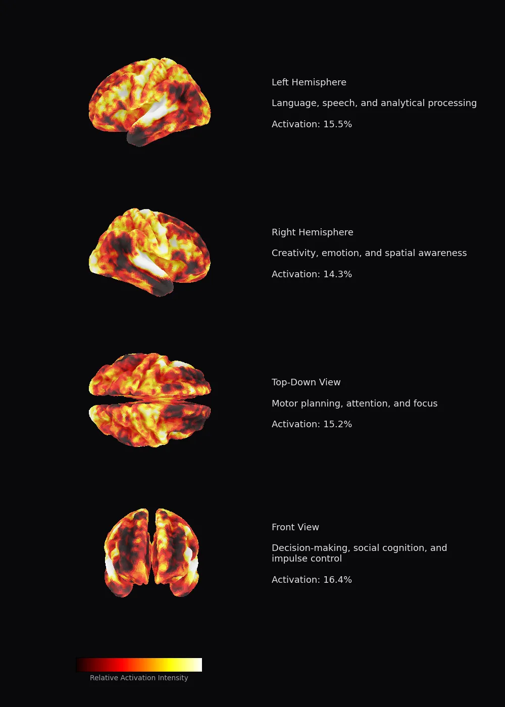

# Content A/B Testing on a Digital Brain Twin

I ran a LinkedIn post through Meta's [TRIBE v2](https://ai.meta.com/blog/tribe-v2-brain-predictive-foundation-model/) — a model trained on 1,100 hours of brain scans from 700+ people — to predict how the human brain responds before anyone ever reads it.

## The Brain Map

This is TRIBE v2's predicted fMRI activation for the final post — ~20,000 cortical vertices, mapped across four views:

<p align="center">
  
</p>

| Brain Region | Activation | What It Processes |
|-------------|-----------|-------------------|
| Left Hemisphere | **15.5%** | Language, logic, analytical thinking |
| Right Hemisphere | **14.3%** | Creativity, emotion, spatial awareness |
| Top-Down View | **15.2%** | Motor planning, attention, focus |
| Front View | **16.4%** | Decision-making, social cognition |

## How It Works

TRIBE v2 processes text through a 3-stage pipeline:

1. **Text → Speech** (gTTS) with word-level timestamps (WhisperX)
2. **Feature extraction** via LLaMA 3.2 (text) + Wav2Vec-BERT (audio)
3. **Brain mapping** — Unified Transformer predicts ~20K cortical vertex activations per second

## What is TRIBE v2?

Meta's trimodal brain encoder that predicts fMRI brain responses from video, audio, or text:

- **Architecture**: V-JEPA2 (video) + Wav2Vec-BERT (audio) + LLaMA 3.2 (text) → Unified Transformer
- **Training data**: 1,115 hours of fMRI from 720 subjects
- **Resolution**: ~70,000 voxels (70x improvement over v1)
- **License**: CC BY-NC 4.0

Links: [Paper](https://ai.meta.com/research/publications/a-foundation-model-of-vision-audition-and-language-for-in-silico-neuroscience/) | [GitHub](https://github.com/facebookresearch/tribev2) | [HuggingFace](https://huggingface.co/facebook/tribev2) | [Demo](https://aidemos.atmeta.com/tribev2/)

## Run It Yourself

### Option 1: HuggingFace Space API (no GPU needed)

```bash
pip install gradio_client
python run_tribe_api.py
```

Calls [Reino0ne/tribev2](https://huggingface.co/spaces/Reino0ne/tribev2) Space — returns brain heatmaps.

### Option 2: Google Colab (full 3D brain surface visualizations)

1. Upload `tribe_demo.ipynb` to [Google Colab](https://colab.research.google.com)
2. Set runtime to **T4 GPU**
3. Accept [LLaMA 3.2-3B license](https://huggingface.co/meta-llama/Llama-3.2-3B) on HuggingFace
4. Add `HF_TOKEN` to Colab Secrets
5. Run all cells

## Repo Structure

```
.
├── README.md
├── run_tribe_api.py          # Runs hooks via HF Space API
├── tribe_demo.ipynb          # Colab notebook with 3D brain maps
├── hooks/
│   ├── hook_a_storyteller.txt
│   ├── hook_b_provocative.txt
│   ├── hook_c_blunt.txt
│   └── hook_d_refined.txt    # Final version (posted)
└── results/
    ├── D_refined_brain.png   # Brain activation for final post
    ├── A_storyteller_brain.png
    ├── B_provocative_brain.png
    └── C_blunt_brain.png
```
