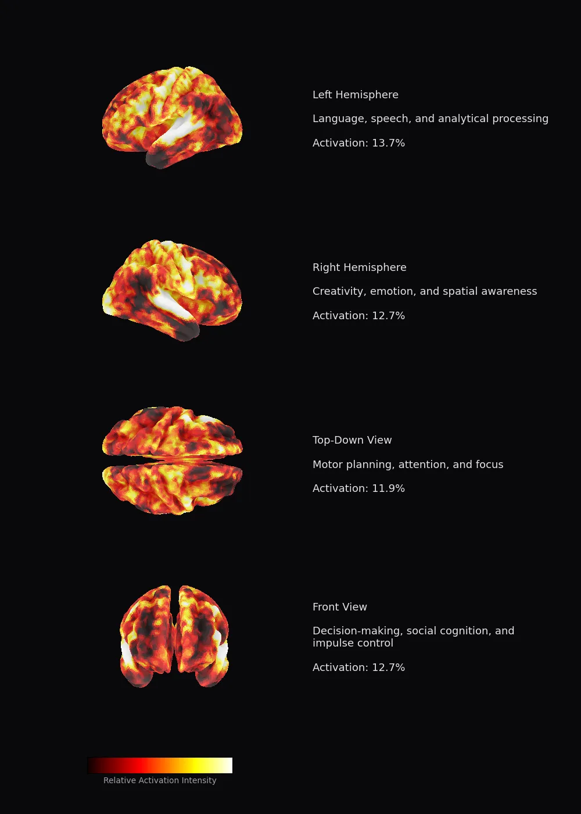
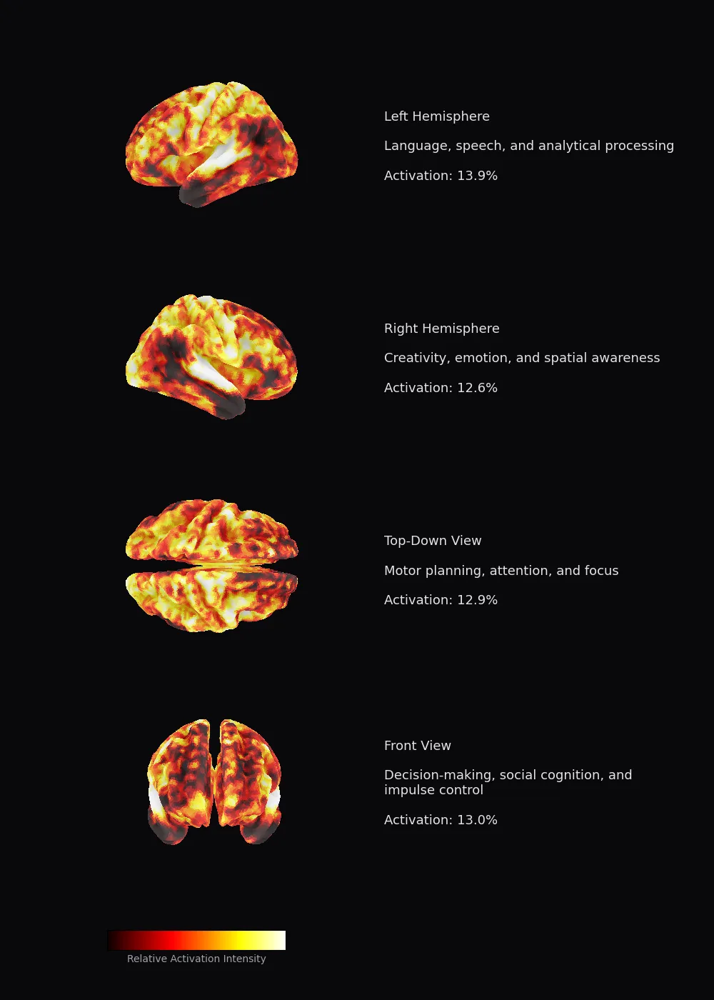

# Content A/B Testing on a Digital Brain Twin

I ran 3 versions of a LinkedIn post through Meta's [TRIBE v2](https://ai.meta.com/blog/tribe-v2-brain-predictive-foundation-model/) — a model trained on 1,100 hours of brain scans from 700+ people — to predict which version would produce the strongest neural response.

## Results

| Hook | Strategy | Neural Engagement | Grade |
|------|----------|-------------------|-------|
| **A — Storyteller** | Narrative arc, builds tension | **76/100** | **B+** |
| B — Provocative | Question hook, meta-twist | 28/100 | F |
| C — Blunt | Short, punchy facts | 4/100 | F |

**The brain wants stories, not bullet points.**

### Hook A Breakdown

| Cognitive System | Score | Grade |
|-----------------|-------|-------|
| Auditory & Language | 81 | A- |
| Executive & Motor | 80 | A- |
| Attention & Spatial | 75 | B+ |
| Visual Processing | 75 | B+ |
| Emotion & Decision | 71 | B |

### Brain Activation Maps

<p align="center">
  
  
</p>

*Left: Hook A (76/100) — Right: Hook C (4/100)*

## What is TRIBE v2?

Meta's trimodal brain encoder that predicts fMRI brain responses from video, audio, or text input:

- **Architecture**: V-JEPA2 (video) + Wav2Vec-BERT (audio) + LLaMA 3.2 (text) → Unified Transformer → ~20K cortical vertex predictions
- **Training data**: 1,115 hours of fMRI from 720 subjects
- **Resolution**: ~70,000 voxels (70x improvement over v1)
- **License**: CC BY-NC 4.0

Links: [Paper](https://ai.meta.com/research/publications/a-foundation-model-of-vision-audition-and-language-for-in-silico-neuroscience/) | [GitHub](https://github.com/facebookresearch/tribev2) | [HuggingFace](https://huggingface.co/facebook/tribev2) | [Demo](https://aidemos.atmeta.com/tribev2/)

## Run It Yourself

### Option 1: HuggingFace Space API (no GPU needed)

```bash
pip install gradio_client
python run_tribe_api.py
```

Calls [Reino0ne/tribev2](https://huggingface.co/spaces/Reino0ne/tribev2) Space — returns brain heatmaps, engagement scorecards, and PDF reports.

### Option 2: Google Colab (full 3D brain visualizations)

1. Upload `tribe_demo.ipynb` to [Google Colab](https://colab.research.google.com)
2. Set runtime to **T4 GPU**
3. Accept [LLaMA 3.2-3B license](https://huggingface.co/meta-llama/Llama-3.2-3B) on HuggingFace
4. Add `HF_TOKEN` to Colab Secrets
5. Run all cells

## Repo Structure

```
.
├── README.md
├── run_tribe_api.py          # Runs all hooks via HF Space API
├── tribe_demo.ipynb          # Colab notebook with 3D brain maps
├── hooks/
│   ├── hook_a_storyteller.txt
│   ├── hook_b_provocative.txt
│   ├── hook_c_blunt.txt
│   └── hook_d_refined.txt    # Refined version based on TRIBE v2 feedback
└── results/
    ├── A_storyteller_brain.webp
    ├── A_storyteller_scorecard.md
    ├── A_storyteller_report.pdf
    ├── B_provocative_brain.webp
    ├── B_provocative_scorecard.md
    ├── B_provocative_report.pdf
    ├── C_blunt_brain.webp
    ├── C_blunt_scorecard.md
    └── C_blunt_report.pdf
```

## Key Takeaway

The same information, structured as a narrative with tension and payoff, scored **19x higher** in predicted neural engagement than the same information delivered as blunt facts. TRIBE v2 confirms what storytellers have always known — the brain is wired for stories.
